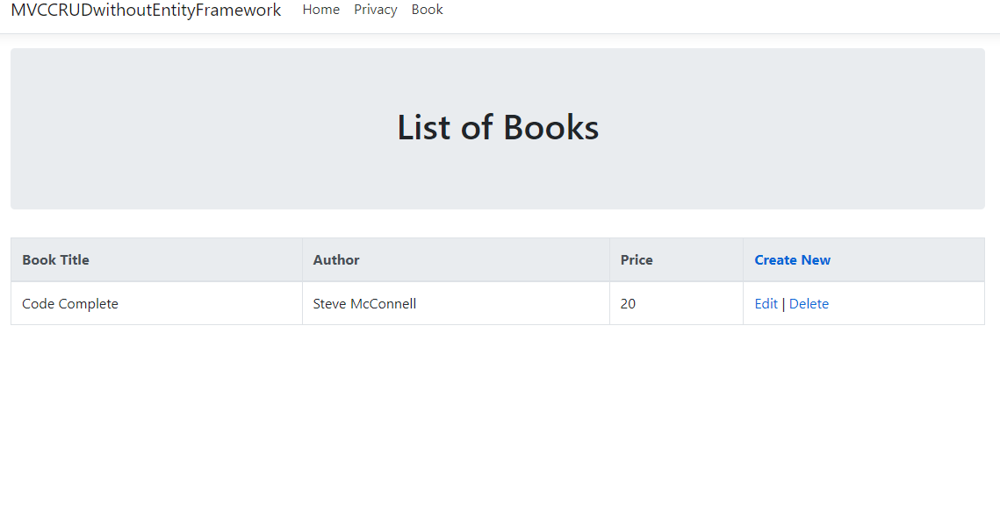
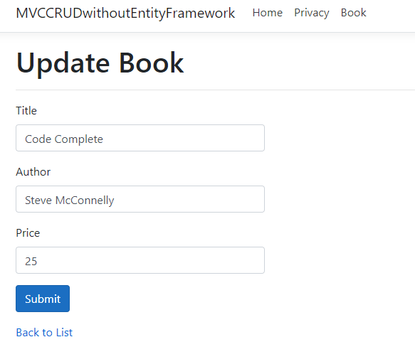
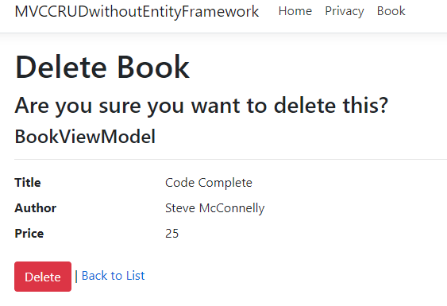

# MVC CRUD demo without EntityFramework
Simple MVC Web App that demonstrates CRUD operations without Entity Framework. (.bak file included to clone and test)

### Setup
Clone Repo
Restore .bak file to local db
Modify your connection string to be valid / correct 
Build and run program 

### Book Index

### Book Edit

### Book Delete

